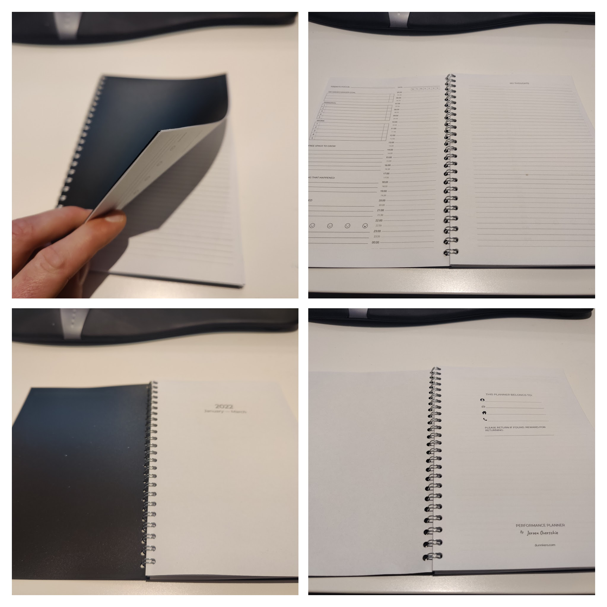

# performance-planner

This tool helps you assembly the correct pages for my _Performance planner_. It is both a journal and a planner and helps you bring structure to your daily routine. 

Check out the [web app](https://dunnkers.com/performance-planner). After assembly, you can download the journal in **PDF**.

## Printing the planner
Once you have the PDF, it's time to print. The planner is made to be printed on **A5** paper size, in a **booklet** format. [Here](https://helpx.adobe.com/acrobat/kb/print-booklets-acrobat-reader.html) is a guide how to print it yourself using Adobe Acrobat. It might be easier, though, to go to a copy shop to let it be printed for you.

This is what a printed version looks like:

✨

## About

This app and the _Performance planner_ were built by [Jeroen Overschie](https://jeroenoverschie.nl/) ✌🏻.
