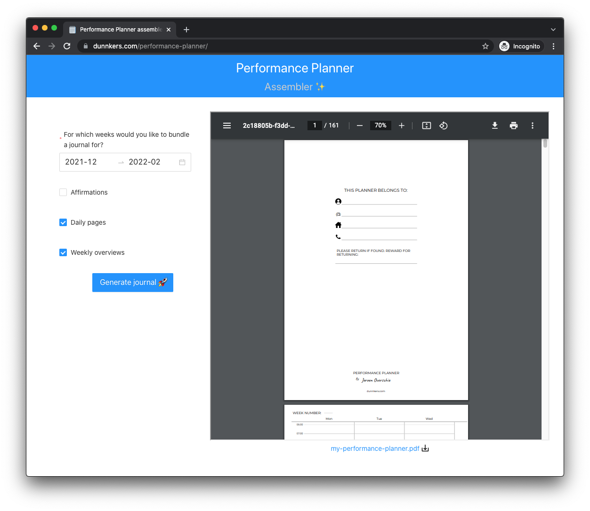

# performance-planner

This tool helps you assembly the correct pages for my _Performance planner_. It is both a journal and a planner and helps you bring structure to your daily routine. 

After assembly, you can download the journal in PDF. Check out the [web app](https://dunnkers.com/performance-planner-assembly).

## About

This app and the _Performance planner_ were built by [Jeroen Overschie](https://jeroenoverschie.nl/) in React.js ✌🏻.